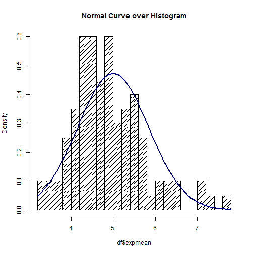
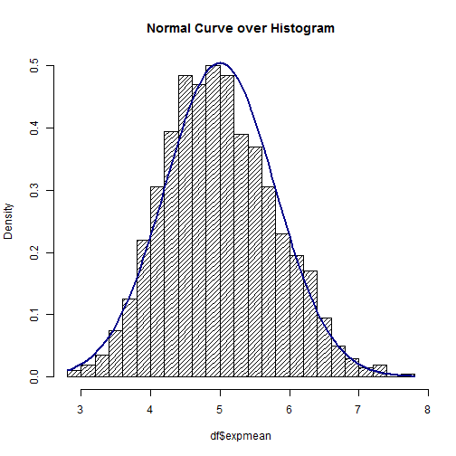
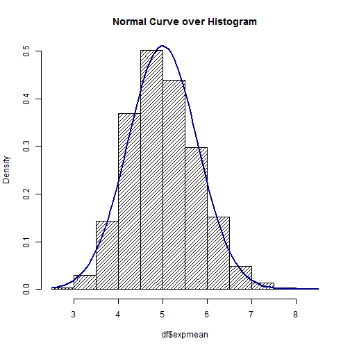

Demonstrating Normal Distribution by Exponential Means Simulations
========================================================
author:Rick Hutchison
date: 01/29/2016

A low number of simulations
========================================================

We are examining the mean of rexp(n,lambda) where n = 40 and lambda = 0.2.  A simulation is the computation of 1 mean.  For the graph below, the number of simulations is 100.  The line is the normal distribution for the sample set.  Notice that the histogram and normal distribution line don't often come together.

A good number of simulations
========================================================

Here we look at a graph of 1000 simulations.  Notice that the histogram bars are coming closer to the normal distribution.

And a lot of simulations
========================================================

As expected, a large number of simulations has revealed that the histogram and the normal distribution are almost exact.

Conclusions
========================================================

- As the number of simulations increase, the closer the output comes to the normal distribution curve.

- Try it yourself using 100, 1000, 2000 simulations at [shinyapps.io](http://dssdba.shinyapps.io/NormalDistributionDemo)

